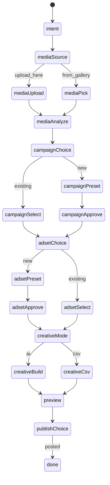

# Chats: Conversational Ad Posting

## Goals

- New **Chats** primary nav section with **secondary nav = chat history** (recents + New chat).
- **Full end-to-end flow** in chat: intent → media → campaign/adset (existing or AI-built presets) → ad creatives (CSV or AI) → preview → publish/schedule.
- **Claude-like UX** (reference screenshots): centered empty state, scrollable thread, floating input, inline widgets—but styled with existing tokens from `[app/globals.css](app/globals.css)` (`glass-`*, `--primary`, Sora/Plus Jakarta).
- **Complement** existing `[/create-ad](app/(frontend)`/(workspace)/create-ad/page.tsx) and `[/manager/post](app/(frontend)`/(workspace)/manager/post/page.tsx); do not remove them.

---

## Architecture

### Hybrid orchestration (recommended)

Use a **server-side finite state machine (FSM)** for step order and validations, with **LLM only where conversation adds value** (preset Q&A, copy suggestions, free-form clarifications). Widget clicks send **structured actions**, not parsed NL.




**Why:** Predictable UX for widgets/approvals; reuses existing Zod schemas in `[lib/assistant/schemas.ts](lib/assistant/schemas.ts)` and Meta APIs; easier to resume sessions from DB.

### Data model (new Prisma models)

Add to `[prisma/schema.prisma](prisma/schema.prisma)`:


| Model           | Purpose                                                                                                                                                                                        |
| --------------- | ---------------------------------------------------------------------------------------------------------------------------------------------------------------------------------------------- |
| `AdChatSession` | `id`, `companyId`, `createdByUserId`, `title`, `status` (`ACTIVE` | `COMPLETED` | `ARCHIVED`), `currentStep` (enum string), `workflowState` (JSON), `bulkUploadId?`, `campaignId?`, timestamps |
| `AdChatMessage` | `id`, `sessionId`, `role` (`user` | `assistant` | `system`), `content?`, `widgetType?`, `widgetPayload?` (JSON), `createdAt`                                                                   |


`workflowState` holds the wizard snapshot (mirrors Create Ad `GroupModel[]`, draft presets, selected IDs, creative fields per bucket, publish job IDs). Title auto-generated from first user message (LLM or truncate).

**Migration:** one Prisma migration; index `(companyId, updatedAt DESC)` for recents. just make changes to prisma.schema the human will handle the migration (DO NOT RUN ANY PRISMA COMMAND)

### API surface


| Route                           | Role                                                                                      |
| ------------------------------- | ----------------------------------------------------------------------------------------- |
| `GET /api/chats`                | List sessions for company (recents)                                                       |
| `POST /api/chats`               | Create session → redirect to `/chats/[id]`                                                |
| `GET /api/chats/[id]`           | Session + messages                                                                        |
| `POST /api/chats/[id]/messages` | User text → orchestrator reply + persisted messages                                       |
| `POST /api/chats/[id]/actions`  | Structured widget events (`media.uploaded`, `campaign.selected`, `preset.approved`, etc.) |


Orchestrator lives in `**lib/chats/orchestrator.ts`** (+ step handlers under `lib/chats/steps/`). Auth: same `getSession()` / `companyId` pattern as gallery and meta routes.

### UI structure

```
app/(frontend)/(workspace)/chats/
  layout.tsx          # full-height, negate workspace p-6 padding
  page.tsx            # new chat landing → POST session → redirect
  [sessionId]/page.tsx
app/components/chats/
  ChatsClient.tsx
  ChatsEmptyState.tsx       # "Back at it, {name}" + centered composer
  ChatsThread.tsx           # RobustaChatShell wrapper
  ChatsHistoryList.tsx      # used inside SideBar secondary panel
  widgets/                  # one file per widget type
  AnalyzingCraftLoader.tsx  # rotating status lines
lib/chats/
  orchestrator.ts, steps/*.ts, types.ts
app/(backend)/api/chats/...
```

**Extend** `[RobustaChatMessage](app/components/assistant/RobustaChatMessage.tsx)` usage via existing `children` slot on `[ChatMessageItem](app/components/assistant/RobustaChatMessage.tsx)`—no breaking change to assistant embeds.

**Sidebar** (`[SideBar.tsx](app/components/sideBar/SideBar.tsx)`):

- Add `chats` to `MAIN_SECTIONS` (MessageSquare icon), `getFirstRoute` → `/chats`, pathname detection `/chats`.
- `case 'chats'`: SectionLabel "Chats", `SecondaryNavButton` "New chat", scrollable **Recents** from `GET /api/chats` (title + relative time; active session highlight).

**Layout tweak:** `[chats/layout.tsx](app/(frontend)`/(workspace)/chats/layout.tsx) uses `flex h-[calc(100vh-...)] -m-6` so the thread is edge-to-edge like Claude, while keeping the global sidebar.

---

## Step-by-step implementation (maps to your 1–5)

### 1. Intent

- User: "I want to make an ad post" (or quick chips: "Post an ad", "New campaign ad").
- Assistant confirms goal; FSM → `mediaSource`.
- Quick replies on empty state mirror Claude pills (styled with `rounded-full bg-clipfox-primary/10`).

### 2. Media

**Widget: `MediaSourceWidget`** — three options:

- **Bulk upload** → open same modal pattern as gallery (`[GalleryUploadZone](app/(frontend)`/(workspace)/gallery/GalleryUploadZone.tsx)) or inline dropzone via `[useUploader](app/hooks/useUploader.ts)`.
- **Upload here** → inline in chat using `uploadWithBulkId` + `[FileCard](app/components/upload/FileCard.tsx)` (same as `[UploadStep](app/components/createAd/steps/UploadStep.tsx)`).
- **Pick from gallery** → searchable grid calling `GET /api/gallery/assets` (+ optional bulk folder filter).

On upload complete, action `media.uploaded` with `{ bulkUploadId, assetIds }`.

**Loading:** `[AnalyzingCraftLoader](app/components/chats/AnalyzingCraftLoader.tsx)` with rotating copy ("Analyzing your craft…", "Polishing the touches…", "Sorting creatives by vibe…") while:

1. `waitForAssetsReady` (extract shared helper to `lib/gallery/wait-for-assets-ready.ts` from UploadStep)
2. `POST /api/gallery/bulk-uploads/{id}/analyze` `{ mode: 'content' }`
3. Load buckets → build `GroupModel[]` (reuse mapping from `[GroupsStep](app/components/createAd/steps/GroupsStep.tsx)`)

### 3. Campaign & ad set

**Widget: `CampaignAdsetChoiceWidget`** — existing vs new.

**Existing campaign → `CampaignPickerWidget`**

- Data: `GET /api/meta/campaigns` + `GET /api/presets/campaign` (same as `[PostToMetaClient](app/components/manager/PostToMetaClient.tsx)`).
- UI: adapt `[OptionCard](app/components/manager/PostToMetaClient.tsx)` / `[SelectCard](app/components/createAd/shared.tsx)` into compact chat cards.

Then **existing vs new ad set** → `AdSetPickerWidget` with `GET /api/meta/adsets?campaignId=`.

**New campaign / ad set**

- Embed conversational preset builder: extract core loop from `[PresetModeRenderer](app/components/assistant/PresetModeRenderer.tsx)` + `/api/assistant/preset-chat`.
- Collect tone, budget, objective, targeting via LLM turns inside FSM substeps (`campaignPreset`, `adsetPreset`).
- `**PresetPreviewWidget`**: reuse `[FieldPreviewCard](app/components/assistant/FieldPreviewCard.tsx)` + Approve / Edit buttons.
- On approve: `POST /api/presets/campaign` or `adset`, then `POST /api/meta/campaigns` / `adsets` (same payloads as wizards).

Persist `campaignId`, `adSetId` (default + per-group overrides in `workflowState`).

### 4. Ad creatives

**Widget: `CreativeModeWidget`** — Manual CSV vs AI.


| Mode               | Behavior                                                                                                                                                                                         |
| ------------------ | ------------------------------------------------------------------------------------------------------------------------------------------------------------------------------------------------ |
| **CSV**            | Upload CSV → parse (reuse column mapping if exists in Post flow; else minimal parser: group key, headline, primary text, landing URL, CTA) → merge into `GroupModel.creative`                    |
| **AI**             | Per included bucket: `POST /api/assistant/creative-suggest` (already used by `[CreativeModeRenderer](app/components/assistant/CreativeModeRenderer.tsx)`); optional refine via `creative-refine` |
| **Create on Meta** | `POST /api/meta/ad-creatives/bulk` with `campaignId` + grouped assets                                                                                                                            |


### 5. Preview & publish

**Widget: `AdPreviewWidget`** — reuse `[MetaAdPreviewCard](app/components/createAd/MetaAdPreviewCard.tsx)` per group (from `[PreviewStep](app/components/createAd/steps/PreviewStep.tsx)`).

Actions: **Approve** | **Request changes** (routes back to creative substep with user note → `creative-refine`).

**Widget: `PublishScheduleWidget`** — Post now vs datetime picker → `POST /api/meta/publish/bulk` (same body shape as Create Ad `[PublishStep](app/components/createAd/steps/PublishStep.tsx)`); poll via existing SSE on `/api/meta/publish/jobs`.

Mark session `COMPLETED` on success; show link to Ad History.

---

## Key reuse map


| Concern       | Reuse                                                                                                                                  |
| ------------- | -------------------------------------------------------------------------------------------------------------------------------------- |
| Chat shell    | `[RobustaChatShell](app/components/assistant/RobustaChatShell.tsx)`, `[MarkdownMessage](app/components/assistant/MarkdownMessage.tsx)` |
| Upload        | `[useUploader](app/hooks/useUploader.ts)`, `[GalleryUploadZone](app/(frontend)`/(workspace)/gallery/GalleryUploadZone.tsx)             |
| Grouping      | `[lib/gallery/analyze-bulk.ts](lib/gallery/analyze-bulk.ts)`, GroupsStep bucket mapping                                                |
| Presets       | `[PresetModeRenderer](app/components/assistant/PresetModeRenderer.tsx)`, `/api/assistant/preset-chat`, `/api/presets/*`                |
| Meta entities | `/api/meta/campaigns`, `adsets`, `ad-creatives`, `publish/bulk`                                                                        |
| Preview       | `[MetaAdPreviewCard](app/components/createAd/MetaAdPreviewCard.tsx)`                                                                   |


**Small refactors (worth doing):**

- `lib/gallery/wait-for-assets-ready.ts` — shared by UploadStep + chats
- `lib/create-ad/group-model.ts` — types + `buildGroupsFromBuckets()` extracted from GroupsStep for Create Ad + chats

---

## Future (document only, not v1)

- Image/video generation endpoints + chat widgets
- Multi-variant ad copy (A/B cards in thread)
- Product-on-model: product upload + model/background gallery + generation API

Add placeholder `workflowState.capabilities` or feature flags so FSM can grow without migration churn.

---

## File touch list (high signal)


| Area           | Files                                                                                                  |
| -------------- | ------------------------------------------------------------------------------------------------------ |
| Schema         | `[prisma/schema.prisma](prisma/schema.prisma)`, new migration                                          |
| APIs           | `app/(backend)/api/chats/route.ts`, `[id]/route.ts`, `[id]/messages/route.ts`, `[id]/actions/route.ts` |
| Orchestrator   | `lib/chats/`*                                                                                          |
| UI             | `app/components/chats/*`, `app/(frontend)/(workspace)/chats/*`                                         |
| Nav            | `[SideBar.tsx](app/components/sideBar/SideBar.tsx)`                                                    |
| Shared extract | `lib/gallery/wait-for-assets-ready.ts`, `lib/create-ad/group-model.ts`                                 |


---

## Testing plan

1. New chat → full flow with **upload here** + AI grouping + **new** campaign/adset presets → AI creatives → preview → publish now.
2. Same flow with **existing** campaign + ad set + **pick from gallery** media.
3. CSV creative path with 2+ groups.
4. Schedule publish → verify `AdPublishJob` + history.
5. Refresh page mid-flow → session restores from DB at correct step.
6. Secondary nav shows recents; switching chats loads correct thread.

---

## Risks / mitigations


| Risk                    | Mitigation                                             |
| ----------------------- | ------------------------------------------------------ |
| Large scope             | Step handlers isolated; widget actions are typed enums |
| LLM drift               | FSM gates transitions; widgets for selections          |
| Long uploads            | Persist `bulkUploadId` early; resumable analyze step   |
| Layout clash with `p-6` | Dedicated `chats/layout.tsx`                           |


