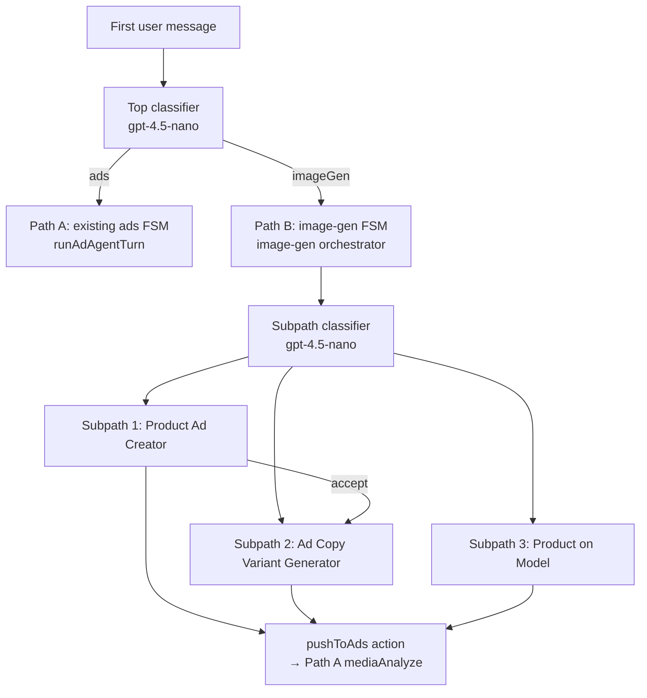

# Robust Image Generation — Implementation Plan

## Current state

Path A (ads posting) is **fully built** in [`lib/chats/orchestrator.ts`](lib/chats/orchestrator.ts) with FSM steps in [`lib/chats/types.ts`](lib/chats/types.ts), LLM agent in [`lib/chats/agent-turn.ts`](lib/chats/agent-turn.ts), and widgets in [`app/components/chats/widgets/ChatWidgets.tsx`](app/components/chats/widgets/ChatWidgets.tsx).

Path B is **entirely absent**: no classifiers, no `gpt-image-1`, no image-gen widgets, no session branching. Reusable foundations exist for **Shopify products** ([`ShopifyProduct`](prisma/schema.prisma), [`GET /api/shop/products`](app/(backend)/api/shop/products/route.ts)), **R2 + Asset pipeline** ([`lib/cloudfare/r2.ts`](lib/cloudfare/r2.ts), upload routes), and **vision JSON prompts** ([`lib/assistant/openai-json.ts`](lib/assistant/openai-json.ts)).



---

## Architecture decisions

### 1. Session branching (minimal schema change)

Add `pathType` column to `AdChatSession`:

```prisma
enum ChatPathType { ADS IMAGE_GEN }
pathType ChatPathType?  // null until first message classified
```

Keep all Path B state in `workflowState.imageGen` (typed JSON) to avoid migration churn. Existing Path A sessions remain unaffected (`pathType` null → treat as `ADS` once step ≠ routing).

### 2. Dual orchestrator pattern

Extend [`handleChatMessage`](lib/chats/orchestrator.ts) and [`handleChatAction`](lib/chats/orchestrator.ts):

| Condition | Handler |
|-----------|---------|
| `pathType` unset + first user message | Run top-level classifier → persist `pathType` → delegate |
| `pathType === ADS` | Existing `runAdAgentTurn` / ad FSM (unchanged) |
| `pathType === IMAGE_GEN` | New `lib/image-gen/orchestrator.ts` |

Path B uses the **same** message/action API surface ([`POST .../messages`](app/(backend)/api/chats/[id]/messages/route.ts), [`POST .../actions`](app/(backend)/api/chats/[id]/actions/route.ts)) — only the action enum and widget types expand.

### 3. New module: `lib/image-gen/`

| File | Responsibility |
|------|----------------|
| `models.ts` | `CLASSIFIER_MODEL = 'gpt-4.5-nano'`, `COLLECTOR_MODEL = 'gpt-4.5-mini'`, `PROMPT_MODEL = 'gpt-4.5'`, `IMAGE_MODEL = 'gpt-image-1'` |
| `classify-top-level.ts` | `{ path: 'ads' \| 'imageGen' }` from first message |
| `classify-subpath.ts` | `{ subpath: 'productAd' \| 'variantGen' \| 'productOnModel' }` |
| `collect-fields-agent.ts` | Multi-turn JSON agent; max 6 assistant questions; required fields: product image, description, brand tone, copy count, aspect ratio (optional) |
| `variant-prompts.ts` | Vision + taxonomy → N `{ ideaLabel, prompt }` pairs; regenerate subset on user edits |
| `generate-image.ts` | OpenAI Images API wrapper (reference image + prompt + aspect ratio) |
| `store-generated.ts` | Decode response → `PutObject` R2 → create `Asset` (`assetType: IMAGE`, `uploadSource: GENERATED`, `aiGenerated: true`) → return public R2 URL |
| `batch-generate.ts` | `Promise.allSettled` over N prompts; auto-retry once; return `{ succeeded[], failed[] }` |
| `orchestrator.ts` | Path B FSM: step transitions, widget emission, action handling |
| `types.ts` | `ImageGenSubpath`, `ImageGenStep`, `ImageGenState`, actions, widgets |
| `catalog.ts` | Static model/background/pose manifest (see below) |
| `base-prompts.ts` | Subpath 1 single-image base prompt builder |

Add `UploadSource.GENERATED` to [`prisma/schema.prisma`](prisma/schema.prisma) enum.

### 4. Static asset catalog (Subpath 3)

Create curated assets under [`public/image-gen/`](public/image-gen/):

```
public/image-gen/
  models/male|female|kids/*.jpg
  backgrounds/*.jpg
  poses/*.jpg
```

Manifest in [`lib/image-gen/catalog.ts`](lib/image-gen/catalog.ts):

```ts
{ id, category, label, imageUrl, r2Key? }
```

At generation time, reference images are loaded from public URLs (or pre-uploaded to R2 once at deploy). Widgets render category tabs + selectable thumbnails.

---

## Path B FSM — steps and widgets

### Shared types (`ImageGenState`)

```ts
type ImageGenState = {
  subpath: 'productAd' | 'variantGen' | 'productOnModel';
  step: ImageGenStep;
  // Data collection
  productImageAssetId?: string;
  productImageUrl?: string;
  shopifyProductId?: string;
  productDescription?: string;
  brandTone?: string;
  copyCount?: number;
  aspectRatio?: string;
  collectorTurns?: number;
  // Subpath 1
  baseGeneratedAssetId?: string;
  baseAccepted?: boolean;
  // Subpath 2
  imageSource?: 'existing' | 'attachment' | 'carriedOver';
  variants?: { ideaLabel: string; prompt: string; assetId?: string; status?: 'pending'|'done'|'failed' }[];
  carryOverFromSubpath1?: boolean;
  // Subpath 3
  selectedModelId?: string;
  selectedBackgroundId?: string;
  selectedPoseId?: string;
  // All generated outputs (for memory + push-to-ads)
  generatedAssets?: { assetId: string; label?: string; subpath: string }[];
  agentMemory?: string;
};
```

### Subpath 1 — Product Ad Creator

| Step | Widget | Actions |
|------|--------|---------|
| `imageSource` | `imageGenSourceChoice` (Shopify / Custom) | `imageGen.source` |
| `shopifyPick` | `shopifyProductPicker` (reuse [`ShopProductsClient`](app/components/shop/ShopProductsClient.tsx) card pattern) | `imageGen.shopifySelected` |
| `customUpload` | `imageGenUpload` (reuse [`useUploader`](app/hooks/useUploader.ts)) | `imageGen.uploaded` |
| `collectFields` | text-only turns from collector agent | (message-driven) |
| `generateBase` | `imageGenGenerating` spinner | server auto-advances |
| `reviewBase` | `imageGenSingleResult` | `imageGen.baseAccepted` / `imageGen.baseRejected` |

On **accept** → auto-enter Subpath 2 with `carryOverFromSubpath1: true`, fields pre-filled, skip image source step.

On **reject** → return to `collectFields` with delta from user message.

### Subpath 2 — Ad Copy Variant Generator

| Step | Widget | Actions |
|------|--------|---------|
| `imageSource` | `imageGenVariantSource` (Existing / Attachment / skip if carried over) | `imageGen.variantSource` |
| `existingAdPick` | `imageGenExistingAdPicker` | `imageGen.existingAdSelected` |
| `collectFields` | collector agent (pre-fill from carry-over) | message-driven |
| `generateIdeas` | server-side | — |
| `reviewIdeas` | `imageGenIdeaReview` (N idea labels, edit/accept all) | `imageGen.ideasAccepted` / `imageGen.ideasChanged` |
| `generateVariants` | `imageGenVariantGrid` (loading → results) | `imageGen.variantRegenerate` (per failed/edited) |

**Existing ads API**: new `GET /api/image-gen/existing-ads` — query `MetaCreative` (+ linked `Asset`) for company where `thumbnailUrl` or `imageUrl` is present; return `{ id, name, thumbnailUrl, assetId }`.

**Prompt generation** ([`variant-prompts.ts`](lib/image-gen/variant-prompts.ts)): system prompt encodes variation taxonomy axes (compositional, lighting/color, subject, contextual/environmental, text/overlay). Output schema:

```json
{ "variants": [{ "ideaLabel": "...", "prompt": "..." }] }
```

Only `ideaLabel` shown in UI; `prompt` stored in `workflowState` only.

**Batch generation**: [`batch-generate.ts`](lib/image-gen/batch-generate.ts) — parallel calls, one retry, partial success UI with per-variant regenerate button.

### Subpath 3 — Product on Model

| Step | Widget | Actions |
|------|--------|---------|
| `productSource` | Shopify picker or upload | same as SP1 step 1 |
| `modelSelect` | `imageGenModelGallery` (male/female/kids tabs) | `imageGen.modelSelected` |
| `backgroundSelect` | `imageGenBackgroundGallery` | `imageGen.backgroundSelected` |
| `poseSelect` | `imageGenPoseGallery` | `imageGen.poseSelected` |
| `generate` | `imageGenSingleResult` | accept/reject/regenerate |

Generation prompt combines product + model + background + pose reference URLs into a single `gpt-image-1` call (multi-reference edit/generation per OpenAI API capabilities — verify exact endpoint during implementation).

---

## Cross-cutting concerns

### R2 storage ([`store-generated.ts`](lib/image-gen/store-generated.ts))

Mirror [`lib/cloudfare/r2-video-thumbnail.ts`](lib/cloudfare/r2-video-thumbnail.ts) pattern:

1. Receive base64/URL from OpenAI response
2. `PutObject` to `generated/{companyId}/{sessionId}/{uuid}.png`
3. Create `Asset` row with `status: READY`, `thumbnailUrl` via [`getR2PublicObjectUrl`](lib/cloudfare/r2.ts)
4. Append to `imageGen.generatedAssets[]`
5. UI always renders R2 public URL, never ephemeral API URLs

### Error handling

Implemented in `batch-generate.ts`:
- First failure → silent retry once
- Second failure → mark variant `status: 'failed'`, show successful siblings
- Widget exposes "Regenerate" per failed variant → single `generate-image.ts` call

### Conversation memory

- Full message history already persisted in `AdChatMessage`
- Collector + variant agents receive last N messages + `ImageGenState` summary + list of prior `generatedAssets` (assetId, label, R2 URL)
- User can reference variants by idea label or 1-based index in natural language; orchestrator resolves against `variants[]`

### Push to Path A ([`imageGen.pushToAds`](lib/chats/orchestrator.ts))

New action accepting `{ assetIds: string[] }`:

1. Create or attach `BulkUpload` with selected assets
2. Set `pathType = ADS`, `currentStep = 'mediaAnalyze'` (or `creativeBuild` if analyze skipped)
3. Patch `workflowState.assetIds` / `bulkUploadId`
4. Emit assistant message + existing `mediaAnalyzing` widget
5. User continues normal ads flow without leaving session

---

## UI changes

Extend [`ChatWidgetRenderer.tsx`](app/components/chats/ChatWidgetRenderer.tsx) and [`ChatWidgets.tsx`](app/components/chats/widgets/ChatWidgets.tsx) with Path B widgets listed above.

Update [`ChatsLanding.tsx`](app/components/chats/ChatsLanding.tsx) suggestions to include image-gen intents (e.g. "Create product ad images", "Generate ad variants").

[`ChatsClient.tsx`](app/components/chats/ChatsClient.tsx): no structural change — widgets dispatch new action types via existing `useChatSession` hook.

New shared picker component: [`app/components/chats/widgets/ImageGenWidgets.tsx`](app/components/chats/widgets/ImageGenWidgets.tsx) (keeps Path A widgets untouched).

---

## API routes to add

| Route | Purpose |
|-------|---------|
| `GET /api/image-gen/existing-ads` | Subpath 2 existing-ad picker |
| `GET /api/image-gen/catalog` | Model/background/pose manifest (optional; can inline in widget payload) |

Generation runs **inside orchestrator actions** (not direct client calls) to keep API keys server-side and enforce R2 persistence.

Extend [`app/(backend)/api/chats/[id]/actions/route.ts`](app/(backend)/api/chats/[id]/actions/route.ts) action union with all `imageGen.*` actions.

---

## Model constants

Add to [`lib/assistant/models.ts`](lib/assistant/models.ts) (or `lib/image-gen/models.ts`):

```ts
export const CLASSIFIER_MODEL = 'gpt-4.5-nano';
export const IMAGE_COLLECTOR_MODEL = 'gpt-4.5-mini';
export const VARIANT_PROMPT_MODEL = 'gpt-4.5';
export const IMAGE_GENERATION_MODEL = 'gpt-image-1';
```

Use existing [`completeJsonChat`](lib/assistant/openai-json.ts) / [`completeJsonChatWithHistory`](lib/assistant/openai-json.ts) for classifiers and collector; extend with multi-image vision helper for variant prompt generation.

---

## Implementation order

Build bottom-up so each layer is testable before wiring UI:

1. **Foundation** — schema migration (`pathType`, `UploadSource.GENERATED`), model constants, `generate-image.ts` + `store-generated.ts` (manual test via script/route)
2. **Classifiers** — top-level + subpath, wired into first-message branch in `handleChatMessage`
3. **Subpath 1** — collector agent, widgets, single-image loop, accept → Subpath 2 handoff
4. **Subpath 2** — existing-ads API, variant prompts, idea review widget, parallel batch + retry, iteration by label
5. **Subpath 3** — static catalog assets + selection widgets + composite generation
6. **Cross-cutting** — push-to-ads bridge, landing suggestions, end-to-end testing
7. **Polish** — regenerate flows, error UX, session resume verification

---

## Key files to modify

| Area | Files |
|------|-------|
| Schema | [`prisma/schema.prisma`](prisma/schema.prisma), new migration |
| Routing | [`lib/chats/orchestrator.ts`](lib/chats/orchestrator.ts), [`lib/chats/types.ts`](lib/chats/types.ts) |
| New core | `lib/image-gen/*` |
| APIs | [`app/(backend)/api/chats/[id]/actions/route.ts`](app/(backend)/api/chats/[id]/actions/route.ts), `app/(backend)/api/image-gen/*` |
| UI | [`app/components/chats/widgets/`](app/components/chats/widgets/), [`ChatWidgetRenderer.tsx`](app/components/chats/ChatWidgetRenderer.tsx) |
| Assets | `public/image-gen/**`, [`lib/image-gen/catalog.ts`](lib/image-gen/catalog.ts) |
| Landing | [`ChatsLanding.tsx`](app/components/chats/ChatsLanding.tsx) |

---

## Risks and mitigations

| Risk | Mitigation |
|------|------------|
| `gpt-image-1` reference-image API differs from spec assumptions | Spike `generate-image.ts` first; adapt to `images.edit` vs `generate` before building widgets |
| Large parallel batches (N copies) | Cap `copyCount` (e.g. max 8) in collector validation; show progress in variant grid |
| Path A regression | `pathType === ADS` delegates to unchanged code path; add integration test for existing ad flow |
| Static model assets licensing | Use royalty-free placeholders; document source in catalog manifest |
| OpenAI cost/latency | Show generating widgets; persist partial results; retry only failed items |

---

## Test plan

1. First message "post my summer sale" → Path A (existing flow unchanged)
2. First message "create product ad for my hoodie" → Path B → Subpath 1 → Shopify pick → collector → single image → accept → Subpath 2 auto-entry with pre-fill
3. Subpath 2 direct entry: existing ad pick → 4 variants → edit 1 idea → parallel gen → 1 fails → retry succeeds
4. Subpath 3: Shopify product → model → background → pose → single result
5. Push 2 generated images to ads → Path A resumes at media analyze → full publish
6. Page refresh mid Path B → session restores step, widgets, and generated image URLs from R2
