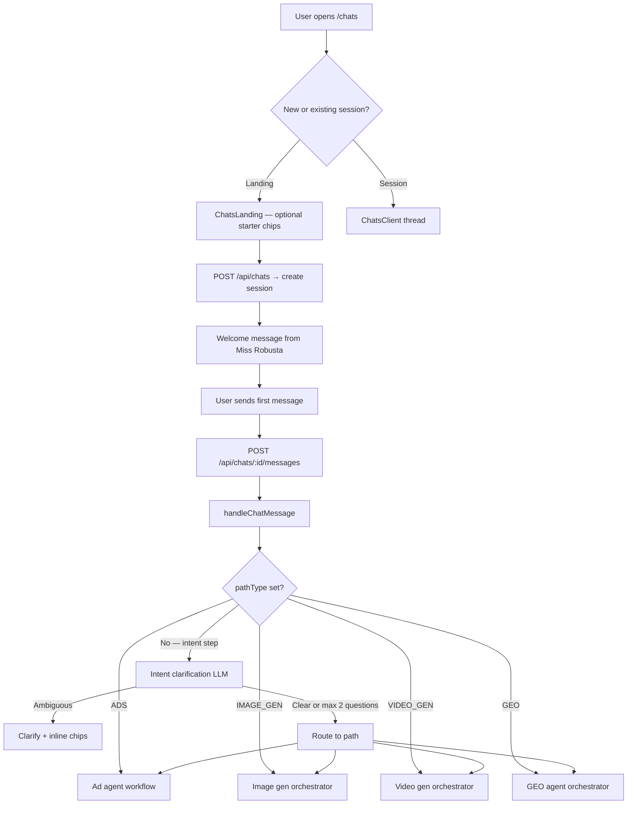

# Miss Robusta — Chatbot Architecture & Behavior

Miss Robusta is the in-product conversational assistant for Robust. She helps users launch paid ads (Meta / Google), generate image creatives, generate video ads, and work on organic visibility (GEO). This document describes how sessions are created, how messages are routed, and what the user sees at each stage.

---

## Overview

| Concept | Description |
|--------|-------------|
| **Persona** | “Miss Robusta” — assistant name shown in the composer |
| **Session model** | `AdChatSession` in Prisma; messages in `AdChatMessage` |
| **Orchestrator** | `lib/chats/orchestrator.ts` — single entry for text messages and widget actions |
| **State** | `workflowState` (JSON) + `currentStep` + optional `pathType` on the session |
| **UI** | `app/components/chats/*` — thread, composer, widgets |

Every chat starts on the **`intent`** step with no `pathType`. The first meaningful user message is classified into one of four top-level paths. After routing, the session is owned by a path-specific orchestrator.

---

## High-level flow



---

## Session lifecycle

### Creation

`POST /api/chats` → `createChatSession()` in `lib/chats/repository.ts`.

- `currentStep`: `'intent'`
- `workflowState`: `{}`
- `pathType`: unset
- **Welcome message** (assistant):  
  *“Hey — I'm Miss Robusta. What are we promoting today? …”*

### Landing vs in-session

| Surface | Chips | Behavior |
|---------|-------|----------|
| **ChatsLanding** (`/chats`) | Full catalog (`CHATS_INTENT_SUGGESTIONS`) | User types or taps a chip → new session created → first message auto-sent |
| **Active session** (`/chats/:id`) | Context-dependent (see [Suggestion chips](#suggestion-chips)) | Messages go to `handleChatMessage` or `handleChatAction` |

### Title

The session title is set from the first user message (first 80 characters) if still `"New chat"`.

---

## Top-level routing (four paths)

After intent is resolved, `pathType` is persisted and routing is sticky for the rest of the session.

| Path | `pathType` | `currentStep` | Orchestrator |
|------|------------|---------------|--------------|
| **Paid ads** | `ADS` | Various workflow steps | `lib/chats/orchestrator.ts` + ad agent |
| **Image generation** | `IMAGE_GEN` | `imageGen` | `lib/image-gen/orchestrator.ts` |
| **Video generation** | `VIDEO_GEN` | `videoGen` | `lib/video-gen/orchestrator.ts` |
| **Organic / GEO** | `GEO` | `geo` | `lib/geo/chat/orchestrator.ts` |

### Classifiers

1. **Intent clarification** (`lib/chats/intent-clarification.ts`) — primary gate on the `intent` step. Can ask up to **2** clarifying questions before forcing a route.
2. **Top-level fallback** (`lib/image-gen/classify-top-level.ts`) — used when clarification returns `ready: true` but needs a path confirm, or on force-route after 2 questions.

### Path semantics (what each path means)

- **ads** — Meta/Facebook/Google campaigns, ad sets, publishing, scheduling, pixel, budgets.
- **imageGen** — AI product images, variants, on-model shots, templates. *Not* posting to ad platforms.
- **videoGen** — Scripts, HeyGen, UGC-style video, replicating winning ads.
- **geo** — Organic growth, citations, share of voice, bounties, content spread. *Not* paid ads.

`intentNotes` in `workflowState` stores a concatenation of user messages from the intent phase for downstream agents.

---

## Intent clarification

**File:** `lib/chats/intent-clarification.ts`  
**Trigger:** `pathType === null` and `currentStep === 'intent'`

### Mechanism

1. User message is persisted.
2. LLM (`CLASSIFIER_MODEL`) returns JSON:
   ```json
   { "ready": boolean, "path"?: "...", "reply"?: string, "suggestions"?: string[] }
   ```
3. **If `ready: false`** (ambiguous intent):
   - Assistant posts a **short clarifying question**.
   - Reply ends by inviting the user to **tap a chip or type manually**.
   - **2–4 suggestion chips** are chosen from the catalog (`lib/chats/chat-path-suggestions.ts`) — only options relevant to the ambiguity, never the full list.
   - State: `intentClarificationTurns++`, `intentClarificationSuggestions` set.
   - User stays on `intent` step.
4. **If `ready: true`** (or 2 questions already asked):
   - Route to the chosen path, clear clarification fields, call the path `init*FromFirstMessage` handler.

### Chip catalog (reference labels)

Defined in `CHATS_INTENT_SUGGESTIONS` — e.g. “Create product ad images”, “Post an ad to Meta”, “What's my share of voice?”, etc. The LLM picks a subset; defaults exist if parsing fails.

### Example

| User says | Behavior |
|-----------|----------|
| “Create product ad images” | Route immediately → `IMAGE_GEN` |
| “i want to generate a new ad” | Clarify: image vs video vs publish; show ≤4 chips under assistant bubble |
| Vague after 2 questions | Force-route via `inferPathFromText()` heuristics |

---

## Suggestion chips

Chips are quick-reply buttons. Where they appear depends on context.

| Context | Location | Source |
|---------|----------|--------|
| Landing page | Above composer | Full `CHATS_INTENT_SUGGESTIONS` |
| Intent clarification | **Inline below assistant message** | `workflowState.intentClarificationSuggestions` |
| ADS workflow steps | Above composer | `lib/chats/composer-suggestions.ts` (step/agent mapping) |
| GEO replies | Above composer | `workflowState.geo.composerSuggestions` (from GEO agent turn) |
| Video gen (some steps) | Above composer | Hard-coded per `videoGen.step` |

**Intent step in active chat:** chips are **not** shown in the composer; they render on the latest assistant clarification message (`ChatsMessage.suggestionChips` in `ChatsClient.tsx`).

Tapping a chip calls the same `sendMessage` path as typing manually.

---

## ADS path (paid growth)

Once routed to `ADS`, free-text messages go through the **ad agent** unless handled by special turn handlers first.

### Message handling order (`handleChatMessage`)

1. Empty picker intent (`tryHandleAdsEmptyPickerTurn`) — user typed instead of using a widget on an empty selection.
2. Widget choice classifier (`tryHandleAdsWidgetChoiceTurn`) — maps text to a widget action.
3. **Ad agent turn** (`runAdAgentTurn` → `executeAgentPlan`).

### Ad agent

| Piece | File |
|-------|------|
| System prompt | `lib/chats/agent-prompt.ts` |
| Plan schema | `lib/chats/agent-schema.ts` |
| Turn runner | `lib/chats/agent-turn.ts` |
| Plan executor | `lib/chats/execute-agent-plan.ts` |

The agent receives:
- User text
- `workflowState` summary
- **Workflow progress** from `buildWorkflowProgress()` (`lib/chats/workflow-manifest.ts`)
- Last N text messages (`AGENT_HISTORY_LIMIT = 10`)

It returns an **AgentPlan**: reply text, optional widget, `nextStep`, `statePatch`, and **actions** (e.g. `preset.build`, `workflow.advance`).

### Logical workflow steps (ADS)

Defined in `LOGICAL_STEPS` in `workflow-manifest.ts`:

```
platform → media → pixel → campaign → adset → creative → preview → publish
```

Each maps to UI `currentStep` values (`mediaSource`, `campaignChoice`, `creativeMode`, `preview`, etc.) and **widgets** (pickers, uploaders, preset builders).

### Widget actions

Interactive UI (upload, pick campaign, approve preset) sends **`POST /api/chats/:id/actions`** with an `action` + `payload`. Handled by `handleChatAction()` in the main orchestrator (and Google-specific handler where needed).

### Platforms

- **Meta** (default): campaigns, ad sets, creatives, publish jobs.
- **Google**: `platform === 'google'` — Search, Display, Performance Max flows with separate widgets and publish paths.

### Navigation

- **Go back** — `workflow.goBack` action; options from `getBackStepOptions()` (`lib/chats/workflow-navigation.ts`).
- Composer may show a “Go back” chip plus step-specific suggestions.

### Error recovery

Meta/preset failures surface in `workflowState.lastOperationError` and the **thinking panel** (not as a normal assistant bubble). Auto-recovery can run via `preset-error-recovery.ts` / `approve-with-recovery.ts`.

---

## IMAGE_GEN path

**Orchestrator:** `lib/image-gen/orchestrator.ts`  
**State:** `workflowState.imageGen` (`ImageGenState`)

### Subpaths

| Subpath | Purpose |
|---------|---------|
| `productAd` | Single product ad image |
| `variantGen` | Multiple variants from a product image |
| `productOnModel` | Product on model / photoshoot |
| `templates` | Template-based generation (catalog templates) |

Subpath is classified by `classifyImageGenSubpath()` on first route.

### Typical flow

1. Collect fields (product, brand tone, etc.) — **skipped when Brand DNA is complete** (`load-brand-dna.ts`).
2. Optional rival inspiration picker.
3. Artist / quality settings (`imageGen.artistSettings`).
4. Generation (`generateImage` — routes to OpenAI, Fal/Seedream for Mr Adasta, etc.).
5. Post-result options (edit, regenerate, carry to variants, publish to ads).

### Brand DNA

Company Brand DNA tables hydrate `ImageGenState` and are injected into generation prompts. Logo URL is appended as a reference image when available (`resolve-company-logo.ts`).

### Actions

Image-gen widget interactions use actions like `imageGen.uploaded`, `imageGen.artistSettings`, `imageGen.generate`, etc., via `handleChatAction` → `handleImageGenAction`.

---

## VIDEO_GEN path

**Orchestrator:** `lib/video-gen/orchestrator.ts`  
**State:** `workflowState.videoGen` (`VideoGenState`)

### Subpaths

Includes **Mr. Adicasso** (AI from brand context), **learn from top ads**, **HeyGen** generation, UGC-style flows. Classified by `classifyVideoGenSubpath()`.

### Behavior

- Vague first messages may show a **subpath choice widget** (`videoGenSubpathChoice`).
- Steps include script generation, duration input, trend pick, HeyGen polling, rival inspiration.
- Composer chips on steps like `durationInput`, `trendPick`, `reviewScript`.

---

## GEO path

**Orchestrator:** `lib/geo/chat/orchestrator.ts`  
**State:** `workflowState.geo` (`GeoChatState`)

### Agent

- `runGeoAgentTurn()` — tool-using agent (citations, bounties, publish, radar metrics).
- Returns `reply`, optional `memory`, `pendingPublish`, **composer suggestions** (3–4 chips).
- Up to `MAX_TOOL_ROUNDS` tool executions per turn.

### UI

GEO suggestion chips appear in the **composer** (not inline on the message), driven by `geo.composerSuggestions`.

---

## UI architecture

### Components

| Component | Role |
|-----------|------|
| `ChatsLanding` | Empty state + start chat |
| `ChatsClient` | Session shell, maps messages → thread |
| `ChatsThread` | Scrollable messages + composer footer |
| `ChatsMessage` | User bubble (right) / assistant prose (left); inline suggestion chips |
| `ChatsComposer` | Text input, attach, composer-level chips |
| `ChatWidgetRenderer` | Interactive widgets on latest assistant widget message |
| `useChatSession` | Fetch session, optimistic user bubbles, `sendMessage`, `dispatchAction` |

### Message types

- **Text** — `content` only.
- **Widget** — `widgetType` + `widgetPayload` on assistant messages (pickers, previews, uploaders).
- **Attachments** — user messages with `widgetType: 'chatAttachments'`.

Only the **latest** widget message stays interactive; older widgets show static media previews.

### Thinking / busy state

While a request is in flight:
- `busy` disables composer.
- Rotating status lines from `resolve-status-messages.ts`.
- Optional ETA countdown (`useChatBusyEta`).
- Errors in collapsible “Error details” under the thinking panel.

### Client ↔ server contract

**Text:** `POST /api/chats/:id/messages` `{ text }` → `OrchestratorResult`

**Actions:** `POST /api/chats/:id/actions` `{ action, payload, userMessage? }`

**OrchestratorResult:**
```ts
{
  session: { id, title, status, currentStep, workflowState, ... },
  messages: SerializedMessage[],      // full thread from DB
  newMessages: SerializedMessage[],   // rows added this turn
  operationError?: string | null,
  statusTone?: 'thinking' | 'fixing',
}
```

`useChatSession.applyResult` merges `messages` + any missing `newMessages` into local state.

---

## API routes

| Route | Method | Purpose |
|-------|--------|---------|
| `/api/chats` | POST | Create session |
| `/api/chats` | GET | List recent sessions |
| `/api/chats/:id` | GET | Load session + messages |
| `/api/chats/:id/messages` | POST | User text → orchestrator |
| `/api/chats/:id/actions` | POST | Widget / workflow actions |
| `/api/chats/from-template` | POST | Start image-gen from template |

---

## Key files reference

```
lib/chats/
  orchestrator.ts          # Main router: intent, ADS, delegates to path orchestrators
  intent-clarification.ts  # Ambiguity gate + inline chip suggestions
  chat-path-suggestions.ts # Master chip label catalog
  composer-suggestions.ts  # Composer chips per step (not intent clarification)
  repository.ts            # Prisma session/message CRUD
  types.ts                 # WorkflowState, steps, SerializedMessage
  agent-turn.ts            # ADS LLM agent
  execute-agent-plan.ts    # Runs agent actions
  workflow-manifest.ts     # Logical ADS progress model
  serialize.ts             # DB ↔ client serialization

lib/image-gen/orchestrator.ts
lib/video-gen/orchestrator.ts
lib/geo/chat/orchestrator.ts

app/components/chats/
  ChatsClient.tsx          # Thread + chip attachment to messages
  ChatsMessage.tsx         # Bubble rendering + inline chips
  useChatSession.ts        # Client session hook
```

---

## State fields (common)

| Field | When set | Purpose |
|-------|----------|---------|
| `intentClarificationTurns` | Intent phase | Count of clarification questions asked |
| `intentClarificationSuggestions` | Intent clarify | Up to 4 chip labels for inline UI |
| `intentNotes` | After route | User intent summary for agents |
| `agentNextStep` | ADS agent | Drives composer chips |
| `agentMemory` | ADS agent | Rolling session notes |
| `lastOperationError` | Meta/preset errors | Thinking panel only |
| `imageGen` / `videoGen` / `geo` | After route | Path-specific sub-state |

---

## Design principles

1. **Single front door** — All chat turns go through one orchestrator that dispatches by `pathType` + `currentStep`.
2. **Clarify before misrouting** — Ambiguous “make an ad” messages get questions, not a 15-chip wall.
3. **Widgets for structure, text for flexibility** — Pickers and forms are widgets; users can always type instead (empty-picker and widget-choice handlers bridge text → actions).
4. **Sticky paths** — Once `pathType` is set, the session stays in that product area.
5. **Progressive disclosure** — Landing shows broad starters; in-session chips are contextual and limited.

---

## Sub-orchestrator docs

| Path | Documentation |
|------|----------------|
| Image generation | [ImageGenOrchestrator.md](./ImageGenOrchestrator.md) |
| Video generation | [VideoGenOrchestrator.md](./VideoGenOrchestrator.md) |
| GEO / organic | [GeoAgentOrchestrator.md](./GeoAgentOrchestrator.md) |

---

*Last updated: reflects intent clarification with inline chips (max 4) and session refresh after clarify turns.*
