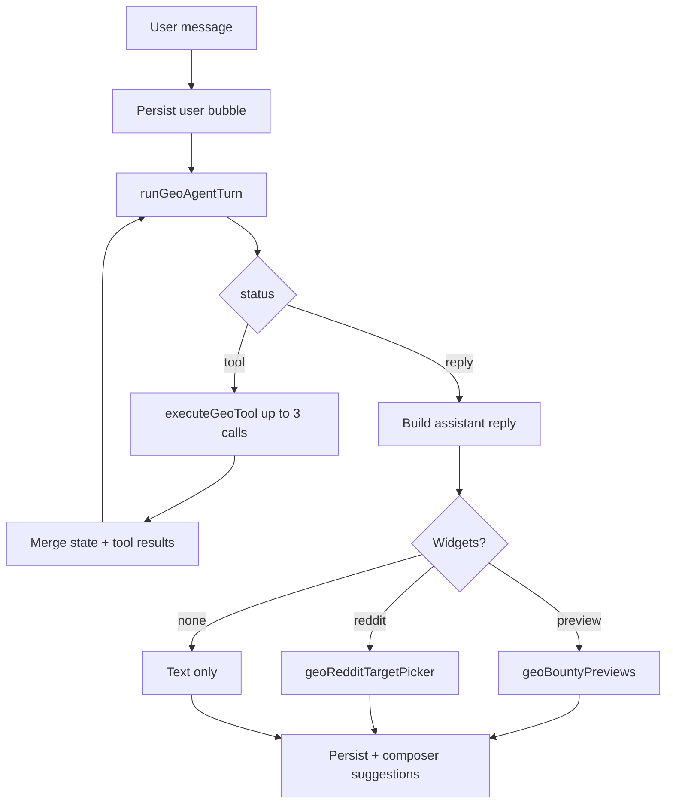

# GEO Agent Orchestrator

Organic visibility strategist inside Miss Robusta: share of voice, GeoKnight prompts, bounties, get-cited content drafts, and multi-platform publishing.

**Parent router:** `lib/chats/orchestrator.ts` delegates when `pathType === 'GEO'` or `currentStep === 'geo'`.

**Entry file:** `lib/geo/chat/orchestrator.ts`

---

## Overview

| Item | Value |
|------|--------|
| Session `pathType` | `GEO` |
| Session `currentStep` | `geo` |
| State key | `workflowState.geo` (`GeoChatState`) |
| Text API | `handleGeoMessage(sessionId, companyId, text, options?)` |
| Actions API | `handleGeoChatAction` — currently `geo.redditTargetPicked` |
| Init on route | `initGeoFromFirstMessage` → `handleGeoMessage` with `skipUserBubble: true` |

Unlike image/video orchestrators, GEO is **fully LLM-agent driven** with a **tool loop** rather than a fixed step machine.

---

## High-level flow



**Max tool rounds:** `MAX_TOOL_ROUNDS = 3` per user message.  
**Agent retries:** Up to `MAX_GEO_AGENT_ATTEMPTS = 3` if JSON parse fails.

---

## Agent turn schema

Defined in `lib/geo/chat/geo-agent-schema.ts`. Model: `CHAT_AGENT_MODEL`.

```json
{
  "status": "tool" | "reply",
  "toolCalls": [{ "name": "geo.fetch_dashboard", "args": {} }],
  "reply": "…",
  "memory": "rolling session notes",
  "suggestions": ["chip 1", "chip 2"],
  "pendingPublish": { "bountyId": "…", "platforms": ["X"], "approveAll": true },
  "redditTargetPicker": { "bountyId": "…" }
}
```

| Field | Purpose |
|-------|---------|
| `status: tool` | Run `toolCalls` then re-prompt agent with results |
| `status: reply` | Final user-facing message |
| `memory` | Persisted to `geo.memory` for future turns |
| `suggestions` | 3–4 composer chips (max 4) for next user turn |
| `pendingPublish` | Staged publish intent before `geo.publish_content` |
| `redditTargetPicker` | Forces in-chat subreddit picker before Reddit publish |

**Rule (prompt):** Never draft blog/social copy inline in `reply` — use `geo.get_cited` for content creation.

---

## Tools (`GEO_TOOL_NAMES`)

Executed by `lib/geo/chat/tools/index.ts` → `executeGeoTool`.

| Tool | Purpose |
|------|---------|
| `geo.fetch_dashboard` | Organic home metrics (`loadOrganicHomeData`) |
| `geo.fetch_geoknight` | GeoKnight topic views / prompt coverage |
| `geo.fetch_bounty` | Bounty workspace summary |
| `geo.fetch_bounty_pages` | Bounty page listing |
| `geo.get_cited` | Create bounty + draft content for query across platforms (X, LinkedIn, Reddit, blog) |
| `geo.get_publish_targets` | List publishable drafts for a bounty |
| `geo.fetch_reddit_targets` | Subreddits / profile targets for Reddit |
| `geo.publish_content` | Publish one platform or `approveAll` batch |

Tool results are JSON-stringified back to the agent (truncated at 12k chars).

### `geo.get_cited`

Key action tool. Args: `query`, `platforms[]`, optional `promptId`.

- Runs `runGetCitedForCompany`
- Sets `geo.lastBountyId`
- Produces draft assets used by preview widget

### `geo.publish_content`

Requires `bountyId`, platform (or `approveAll`). Reddit requires subreddit — if missing, agent should set `redditTargetPicker` and wait for `geo.redditTargetPicked` action.

Clears `pendingPublish` on success.

---

## Assistant widgets

Resolved in `resolveGeoAssistantWidget`:

| Widget | When |
|--------|------|
| `geoBountyPreviews` | Tool results include publishable draft previews (`build-preview-widget.ts`) |
| `geoRedditTargetPicker` | Agent returns `redditTargetPicker.bountyId` |

When previews are shown, internal bounty/content IDs are **stripped from reply text** (`stripInternalIdsFromGeoReply`).

---

## Composer suggestions

Unlike intent clarification (inline on message), GEO chips appear in the **composer** above the input.

- Set from agent turn `suggestions` → `geo.composerSuggestions`
- Cleared on reply turns without suggestions
- Mapped in `lib/chats/composer-suggestions.ts` when `step === 'geo'`

Prompt requires 3–4 contextual chips (e.g. “Publish all drafts”, “Get cited for another query”) — not generic confirm buttons.

---

## State model (`GeoChatState`)

| Field | Purpose |
|-------|---------|
| `memory` | Agent rolling memory across turns |
| `lastBountyId` | Most recent bounty touched |
| `pendingPublish` | Staged publish (platforms, approveAll, Reddit target) |
| `lastToolSummary` | Name of last tool run (debug/context) |
| `composerSuggestions` | Next-turn chip labels |

---

## Actions

### `geo.redditTargetPicked`

Handled in `lib/geo/chat/handle-geo-action.ts`.

User selects subreddit (and optional flair) from `geoRedditTargetPicker`. Updates `pendingPublish.redditSubreddit`, then typically triggers follow-up via `handleGeoMessage` or publish tool on next agent turn.

Other GEO interactions are **free-text messages** that re-enter the agent loop.

---

## Agent prompt & context

| File | Role |
|------|------|
| `geo-agent-prompt.ts` | System prompt + context block (memory, pending publish) |
| `geo-agent-turn.ts` | LLM call, history, retries, failure classification |
| `classify-geo-response-failure.ts` | Detect generic/unusable replies for retry |

History: last N messages via `buildAgentHistoryMessages` (same helper as ADS agent).

---

## Message lifecycle (`handleGeoMessage`)

1. Load session + `workflowState.geo`.
2. Append user message (unless `skipUserBubble` on init).
3. Tool loop (0–3 rounds):
   - `runGeoAgentTurn` with optional `toolResults`
   - If `status === 'tool'`, execute each call, merge state patches
4. Normalize final reply; append preview hint if widget shown.
5. Persist assistant message (+ widget if any).
6. Update session `pathType: GEO`, `currentStep: geo`, `workflowState.geo`.
7. Refresh session from DB; return `OrchestratorResult`.

---

## Init from intent routing

```text
initGeoFromFirstMessage(sessionId, companyId, text)
  → set pathType + currentStep
  → handleGeoMessage(..., { skipUserBubble: true })
```

User line was already saved during intent routing in parent orchestrator.

---

## UI components

GEO widgets live in chat widget renderer (bounty preview tabs, Reddit picker). Composer shows suggestion chips from state.

Busy state uses standard thinking panel (GEO does not suppress it like image/video generation steps).

---

## Key files

```
lib/geo/chat/
  orchestrator.ts         # Tool loop + message persistence
  geo-agent-turn.ts       # LLM turns
  geo-agent-schema.ts     # Zod schema + tool names
  geo-agent-prompt.ts     # System prompt
  handle-geo-action.ts    # Reddit picker action
  build-preview-widget.ts # Preview payload from tool results
  confirm-publish.ts      # Publish confirmation helpers
  types.ts                # GeoChatState
  tools/
    index.ts              # executeGeoTool
    summarize.ts          # Shrink tool payloads for LLM

lib/geo/bounty/           # get_cited, publish, spread platforms
lib/geo/geoknight/        # Topic views
lib/organic/home/         # Dashboard data
```

---

## Example user journeys

| User intent | Typical tool chain |
|-------------|-------------------|
| “What's my share of voice?” | `fetch_dashboard` → reply with metrics |
| “Get cited for {prompt}” | `get_cited` → previews widget → user approves → `publish_content` |
| Reddit publish | `get_cited` → `redditTargetPicker` → user picks → `publish_content` |
| GeoKnight exploration | `fetch_geoknight` with topic filters |

---

## Integration with parent chat

```text
handleChatMessage (intent → geo)
  → initGeoFromFirstMessage

All subsequent text:
  → handleGeoMessage

Reddit picker only:
  → handleChatAction('geo.redditTargetPicked')
```

Parent orchestrator blocks other actions while on GEO step (non-Reddit actions return current session unchanged).

See also: [MissRobusta.md](./MissRobusta.md)
