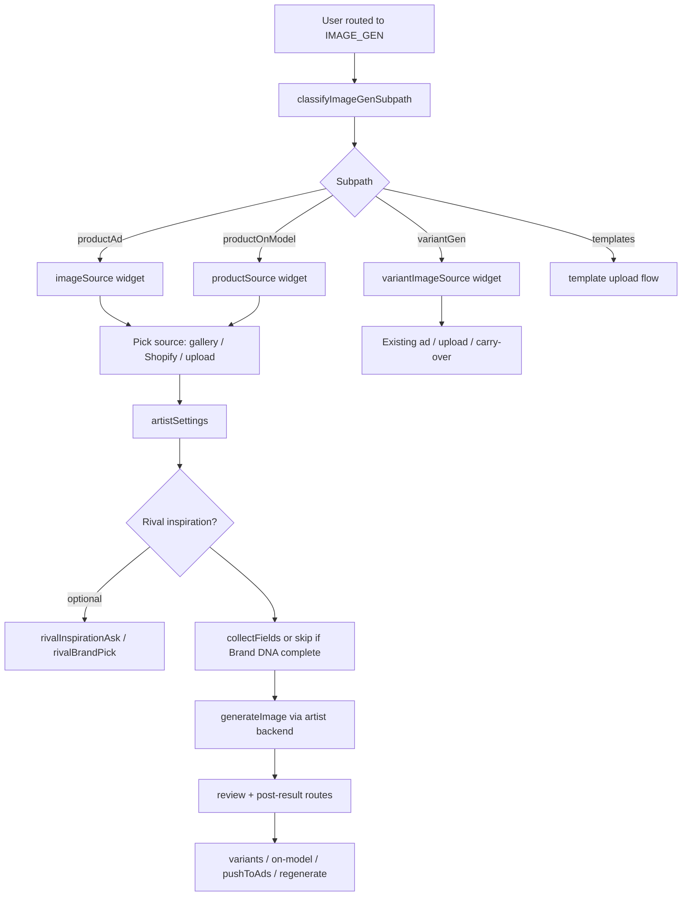

# Image Gen Orchestrator

AI product image generation inside Miss Robusta chat sessions. Handles four subpaths: single product ads, copy variants, product-on-model shots, and catalog templates.

**Parent router:** `lib/chats/orchestrator.ts` delegates here when `pathType === 'IMAGE_GEN'` or `currentStep === 'imageGen'`.

**Entry file:** `lib/image-gen/orchestrator.ts`

---

## Overview

| Item | Value |
|------|--------|
| Session `pathType` | `IMAGE_GEN` |
| Session `currentStep` | `imageGen` |
| State key | `workflowState.imageGen` (`ImageGenState`) |
| Text API | `handleImageGenMessage(sessionId, companyId, text)` |
| Actions API | `handleImageGenAction(sessionId, companyId, action, payload, userMessage?)` |
| Init on route | `initImageGenFromFirstMessage(session, workflowState, userText)` |

---

## High-level flow



---

## Subpaths

Classified by `lib/image-gen/classify-subpath.ts` on first message (or set explicitly for template sessions via `POST /api/chats/from-template`).

| Subpath | Purpose | First step |
|---------|---------|------------|
| `productAd` | Single hero product ad image | `imageSource` → `imageGenSourceChoice` |
| `variantGen` | Multiple copy/visual variants from one base | `variantImageSource` → `imageGenVariantSource` |
| `productOnModel` | Product placed on model with pose/background | `productSource` → `imageGenSourceChoice` (mode: productOnModel) |
| `templates` | Fixed layout from template catalog | `templateUpload` → notes → `generateTemplate` |

---

## Steps (`ImageGenStep`)

State machine field: `imageGen.step`. Not every step is used in every subpath.

| Step | Typical use |
|------|-------------|
| `imageSource` / `variantImageSource` / `productSource` | Where the base product image comes from |
| `shopifyPick` | Shopify product picker |
| `customUpload` | User upload via composer attach |
| `artistSettings` | Pick artist + quality (`imageGenArtistSettings` widget or composer bar) |
| `rivalInspirationAsk` / `rivalBrandPick` | Optional rival creative intelligence |
| `collectFields` | LLM collects description, tone, copy count |
| `generateBase` / `generateIdeas` / `generateVariants` / `generateOnModel` / `generateTemplate` | Active generation (busy UI) |
| `reviewBase` / `reviewIdeas` / `reviewOnModel` / `reviewTemplate` | User approves or requests changes |
| `modelSelect` / `backgroundSelect` / `poseSelect` | On-model catalog galleries |
| `chooseNext` | Post-result routing (variants, ads, new product ad, etc.) |
| `done` | Terminal |

---

## Message handling order

`handleImageGenMessage` runs handlers in this order:

1. **`tryHandleImageGenEmptyPickerTurn`** — user typed instead of selecting from an empty picker.
2. **`tryHandleImageGenWidgetChoiceTurn`** — maps free text to a widget option.
3. **Step-specific branches** — `collectFields`, rival pickers, template notes, idea review, post-result text.
4. Falls through to **`classifyPostResultNext`** when reviewing a generated image.

User messages are always persisted; assistant replies may include widgets.

---

## Actions (`ImageGenActionType`)

Dispatched via `POST /api/chats/:id/actions`. Handled in `handleImageGenAction`.

| Action | Effect |
|--------|--------|
| `imageGen.source` | User chose image source (gallery / Shopify / upload) |
| `imageGen.shopifySelected` | Shopify product picked |
| `imageGen.uploaded` | Image attached; sets `productImageAssetId` |
| `imageGen.artistSettings` | Artist + quality confirmed |
| `imageGen.rivalInspirationChosen` | Yes/no on rival inspiration |
| `imageGen.rivalBrandChosen` | Specific rival or “mix top rivals” |
| `imageGen.variantSource` | Base image for variant flow |
| `imageGen.existingAdSelected` | Pick existing ad creative as base |
| `imageGen.baseAccepted` / `baseRejected` | Product ad review |
| `imageGen.ideasAccepted` / `ideasChanged` | Variant idea review |
| `imageGen.variantRegenerate` | Re-run one variant slot |
| `imageGen.modelSelected` / `backgroundSelected` / `poseSelected` | On-model catalog picks |
| `imageGen.onModelAccepted` / `onModelRejected` | On-model review |
| `imageGen.nextStepChosen` | Post-result route (variants, ads, etc.) |
| `imageGen.pushToAds` | Hand off generated images to ADS workflow |
| `imageGen.templateRegenerate` | Re-run one template output slot |

---

## Widgets (`ImageGenWidgetType`)

Rendered by `app/components/chats/widgets/ImageGenWidgets.tsx` via `ChatWidgetRenderer`. Only the **latest** widget message stays interactive.

| Widget | Purpose |
|--------|---------|
| `imageGenSourceChoice` | Gallery / Shopify / upload |
| `shopifyProductPicker` | Shopify product list |
| `imageGenUpload` | Upload prompt / state |
| `imageGenArtistSettings` | Artist + quality picker |
| `imageGenGenerating` | Spinner during generation |
| `imageGenSingleResult` | Single image result + actions |
| `imageGenVariantSource` | Variant base source |
| `imageGenExistingAdPicker` | Pick from existing ads |
| `imageGenIdeaReview` | Approve/edit variant ideas |
| `imageGenVariantGrid` | Generated variant grid |
| `imageGenModelGallery` / `BackgroundGallery` / `PoseGallery` | On-model catalogs |
| `imageGenNextStep` | Post-result options |
| `imageGenPushToAds` | Confirm handoff to ads |
| `imageGenTemplateGrid` | Template output grid |
| `imageGenRivalInspirationChoice` / `RivalBrandPicker` | Rival analysis |

---

## Image artists & generation

Defined in `lib/image-gen/image-artists.ts`. Selected in `artistSettings` step.

| Artist | Provider | Backend |
|--------|----------|---------|
| Mr Adicasso | OpenAI | `gpt-image-2` |
| Mr Crafta | OpenAI | `gpt-image-1.5` |
| Tintin | OpenAI | `gpt-image-1` |
| Mr Adasta | Fal | Seedream 4.5 text-to-image / edit (`FAL_KEY` required) |

`generateImage()` in `lib/image-gen/generate-image.ts` routes by `provider`. Reference images (product, logo, on-model refs) are passed when available.

**Company logo:** `resolve-company-logo.ts` appends logo URL to generation refs for product ad, variants, on-model, and templates (skipped on edit/regenerate).

**Prompt building:** `base-prompts.ts`, `variant-prompts.ts`, `prompt-variations.ts`, `artist-styles.ts` — includes anti-sameness variation blocks and Brand DNA injection.

---

## Brand DNA auto-fill

`lib/image-gen/load-brand-dna.ts` loads four DNA tables (Visual, Communication, Audience, Compliance) for the company’s `BrandEntity`.

When collection is complete (`isCollectionComplete` in `collect-fields-agent.ts`):

- `collectFields` step is **skipped**
- `brandDnaApplied`, `brandDnaStructured`, `brandDnaPromptBlock` are set on state
- Generation LLMs receive structured DNA in prompts

Missing fields (e.g. copy count) still prompt the user.

---

## Collect-fields agent

`lib/image-gen/collect-fields-agent.ts` — conversational collector for:

- Product description
- Brand tone (skipped if DNA provides it)
- Copy count (variants)
- Template-specific fields via `template-collector-agent.ts`

Turns increment `collectorTurns` on state. When `complete`, orchestrator calls `runGenerateBase`, `runGenerateIdeas`, or template generate.

---

## Post-result routing

After a successful generation, `classify-post-result-next.ts` classifies user intent:

| Route | Behavior |
|-------|----------|
| `variants` | Carry image into `variantGen` subpath |
| `regenerate` | Re-run with `rejectFeedback` |
| `productOnModel` | Start on-model flow with product image |
| `newProductAd` | Fresh product ad with carried image |
| `postToAds` | Create bulk upload + switch to ADS `campaignChoice` |

`pushToAds` creates a `BulkUpload` from `generatedAssets`, sets `pathType: ADS`, and shows `campaignChoice` widget.

---

## Rival inspiration

Shared with video gen via `lib/rival-analysis/rival-inspiration-chat.ts`.

If the company has rivals with completed summaries:

1. Ask yes/no (`rivalInspirationAsk`)
2. Optionally pick brand or “mix top rivals” (`rivalBrandPick`)
3. Inject `rivalIntelligenceBrief` into generation prompts

---

## State model (`ImageGenState`)

Key fields (see `lib/image-gen/types.ts` for full schema):

| Field | Purpose |
|-------|---------|
| `subpath` / `step` | Current flow position |
| `productImageAssetId` / `productImageUrl` | Base product image |
| `imageArtistId` / `imageQuality` | Generation backend |
| `productDescription` / `brandTone` / `copyCount` | Collector fields |
| `brandDnaApplied` / `brandDnaStructured` | DNA hydration |
| `baseGeneratedAssetId` / `variants` / `templateOutputs` | Outputs |
| `generatedAssets` | History for push-to-ads |
| `rivalInspirationEnabled` / `rivalIntelligenceBrief` | Rival context |
| `templateId` / `templateCollectedFields` | Templates subpath |
| `rejectFeedback` | Regenerate instructions |

---

## UI notes

- **Artist settings in composer:** When `step === 'artistSettings'`, `ImageGenArtistSettingsBar` appears in the composer (`ChatsClient`).
- **Attachments:** Uploads use `chatAttachments` user bubbles; `imageGen.uploaded` skips duplicate text bubble.
- **Busy states:** `resolve-status-messages.ts` shows generation-specific labels when `step` is in generating set.
- **Composer chips:** Video-style step chips are N/A; image gen uses widgets primarily.

---

## Key files

```
lib/image-gen/
  orchestrator.ts       # Main state machine
  types.ts              # State, actions, widgets
  classify-subpath.ts   # productAd | variantGen | productOnModel
  collect-fields-agent.ts
  load-brand-dna.ts
  generate-image.ts     # OpenAI / Fal routing
  image-artists.ts
  base-prompts.ts / variant-prompts.ts
  batch-generate.ts
  template-generate.ts
  resolve-company-logo.ts
  state.ts              # parse/merge helpers

app/components/chats/
  widgets/ImageGenWidgets.tsx
  ImageGenArtistSettingsBar.tsx
```

---

## Integration with parent chat

```text
handleChatMessage (intent resolved → imageGen)
  → initImageGenFromFirstMessage
  → classifyImageGenSubpath → startSubpath

Subsequent messages:
  → handleImageGenMessage

Widget clicks / uploads:
  → handleChatAction → handleImageGenAction
```

See also: [MissRobusta.md](./MissRobusta.md) for top-level routing and intent clarification.
