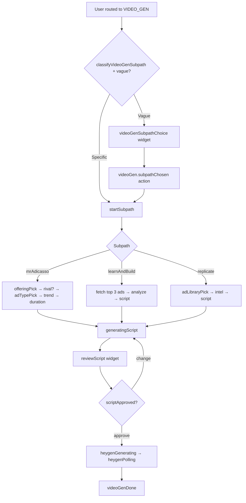

# Video Gen Orchestrator

AI video ad creation inside Miss Robusta chat: script writing, top-ad intelligence, HeyGen rendering, and ad replication.

**Parent router:** `lib/chats/orchestrator.ts` delegates when `pathType === 'VIDEO_GEN'` or `currentStep === 'videoGen'`.

**Entry file:** `lib/video-gen/orchestrator.ts`

---

## Overview

| Item | Value |
|------|--------|
| Session `pathType` | `VIDEO_GEN` |
| Session `currentStep` | `videoGen` |
| State key | `workflowState.videoGen` (`VideoGenState`) |
| Text API | `handleVideoGenMessage(sessionId, companyId, text)` |
| Actions API | `handleVideoGenAction(sessionId, companyId, action, payload, userMessage?)` |
| Init on route | `initVideoGenFromFirstMessage(session, workflowState, userText)` |

`directorPrompt` is stored server-side for HeyGen but **stripped from client responses** via `sanitizeWorkflowStateForClient`.

---

## High-level flow



---

## Subpaths

Classified by `lib/video-gen/classify-subpath.ts`.

| Subpath | Label | Summary |
|---------|-------|---------|
| `mrAdicasso` | Mr. Adicasso | Brand-context script from company offerings + optional rival intel |
| `learnAndBuild` | Learn and Build | Analyze top 3 performing video ads, synthesize brief, write script |
| `replicate` | Replicate an Ad | User picks library video; intelligence brief drives script |

If the first user message is **vague** (no keywords like “learn”, “replicate”, “adicasso”), the orchestrator shows **`videoGenSubpathChoice`** instead of auto-starting.

---

## Steps (`VideoGenStep`)

| Step | Purpose |
|------|---------|
| `routing` | Awaiting subpath choice |
| `offeringPick` | Multiple company offerings — pick one (`videoGenOfferingPicker`) |
| `rivalInspirationAsk` / `rivalBrandPick` | Optional rival creative intel (Mr Adicasso path) |
| `adTypePick` | Video ad category (`videoGenAdTypePicker`) |
| `trendPick` | Trend topic for trend-induced ads |
| `durationInput` | Short / medium / long (`classify-duration.ts`) |
| `generatingScript` | LLM writing script (`videoGenGenerating`) |
| `reviewScript` | User approves or requests changes (`videoGenScriptReview`) |
| `fetchTopAds` / `analyzingAds` | Learn-and-build pipeline |
| `adLibraryPick` | Replicate: pick source video (`videoGenAdLibraryPicker`) |
| `runningIntel` | Per-asset intelligence for replicate |
| `heygenGenerating` / `heygenPolling` | HeyGen job start + poll (`videoGenHeygenProgress`) |
| `done` | Final video delivered (`videoGenDone`) |

---

## Subpath details

### Mr. Adicasso (`mrAdicasso`)

1. Load `companyContext` (`load-company-context.ts`) — brand, offerings, selected offering.
2. If multiple offerings → `offeringPick`.
3. Optional **rival inspiration** (same module as image gen).
4. `adTypePick` — one of 9 categories (UGC, POV, before/after, etc.).
5. `trendPick` when category is `trendInduced`.
6. `durationInput` — classified from text or composer chips.
7. `runScriptGeneration` → `reviewScript`.

### Learn and Build (`learnAndBuild`)

1. `analyzingAds` — `runTopAdsIntelligencePipeline` fetches top 3 video assets + intelligence.
2. On success → straight to script generation.
3. On failure → fallback subpath choice widget.

### Replicate (`replicate`)

1. `adLibraryPick` — up to 50 company video assets.
2. On select → load asset intelligence → script generation in replicate mode.

---

## Ad categories

`VIDEO_GEN_AD_CATEGORIES` in `lib/video-gen/types.ts`:

Before & After, POV, UGC, Product Review, Discount/Offer, Direct Comparison, Q&A, Pain Point, Trend-Induced.

User can pick via widget or type a matching label (`matchAdCategoryByText`).

---

## Script generation

`lib/video-gen/generate-script.ts` produces:

- `adScript` — user-facing script (shown in review widget)
- `directorPrompt` — HeyGen-oriented direction (server-only)

Inputs: company context, intelligence brief, rival brief, ad category, trend, duration bucket, replicate mode, change feedback.

**Script review:**

- `videoGen.scriptApproved` → start HeyGen (`startHeygenFromChat`)
- `videoGen.scriptChangeRequested` → re-run with `changeFeedback` (`classify-change-intent.ts` for category/duration tweaks)

Composer chips on `reviewScript`: “Approve”, “Make the hook stronger”, “More emotional tone”.

---

## HeyGen pipeline

On script approval:

1. `heygenGenerating` — `startHeygenFromChat` with `directorPrompt`, subpath, offering context.
2. `heygenPolling` — `syncHeygenJob` until complete or failure.
3. `videoGenDone` — `generatedAssetId` on state, final widget with playback.

Status endpoint: `GET /api/chats/:id/video-gen/status` for client polling if needed.

---

## Message handling order

`handleVideoGenMessage`:

1. **`tryHandleVideoGenWidgetChoiceTurn`** — text → widget action mapping.
2. Step branches: rival pickers, `offeringPick`, `adTypePick`, `trendPick`, `durationInput`, `reviewScript` (change intent).
3. Free-text duration/category matching where applicable.

---

## Actions (`VideoGenActionType`)

| Action | Effect |
|--------|--------|
| `videoGen.subpathChosen` | User picked Mr Adicasso / Learn / Replicate |
| `videoGen.offeringSelected` | Offering ID for Mr Adicasso |
| `videoGen.rivalInspirationChosen` | Rival yes/no |
| `videoGen.rivalBrandChosen` | Rival brand or mix |
| `videoGen.adTypeSelected` | Ad category |
| `videoGen.trendSubmitted` | Trend topic text |
| `videoGen.scriptApproved` | Start HeyGen |
| `videoGen.scriptChangeRequested` | Regenerate script with feedback |
| `videoGen.adSelected` | Replicate library pick |
| `videoGen.retryIntel` | Retry intelligence pipeline |

---

## Widgets (`VideoGenWidgetType`)

Rendered by `app/components/chats/widgets/VideoGenWidgets.tsx`.

| Widget | When |
|--------|------|
| `videoGenSubpathChoice` | Vague first message or learn-and-build failure |
| `videoGenOfferingPicker` | Multiple offerings |
| `videoGenAdTypePicker` | Category selection |
| `videoGenScriptReview` | Script approval |
| `videoGenAdLibraryPicker` | Replicate source pick |
| `videoGenAnalyzing` | Top ads / intel running |
| `videoGenGenerating` | Script generation |
| `videoGenHeygenProgress` | HeyGen job in flight |
| `videoGenDone` | Finished video |
| `videoGenRivalInspirationChoice` / `RivalBrandPicker` | Rival flow |

---

## Composer chips

From `lib/chats/composer-suggestions.ts` when `step === 'videoGen'`:

| Step | Chips |
|------|-------|
| `durationInput` | Keep it short / ~30 seconds / ~60 seconds |
| `trendPick` | Trending sound / Seasonal trend / Viral challenge |
| `reviewScript` | Approve / Make the hook stronger / More emotional tone |

---

## State model (`VideoGenState`)

| Field | Purpose |
|-------|---------|
| `subpath` / `step` | Flow position |
| `offeringId` / `companyContext` | Brand + product context |
| `adCategory` / `trendTopic` / `durationBucket` | Creative parameters |
| `adScript` / `directorPrompt` | Script artifacts |
| `topAssetIds` / `intelligenceBrief` | Learn-and-build / replicate intel |
| `replicateAssetId` | Selected library video |
| `heygenJobId` / `generatedAssetId` | HeyGen output |
| `rivalInspirationEnabled` / `rivalIntelligenceBrief` | Rival context |
| `changeTurns` | Script revision count |
| `lastError` | Last failure message |

---

## UI / busy behavior

`ChatsThread` treats these steps as **video-gen busy** (hides generic thinking panel during long operations):

`generatingScript`, `fetchTopAds`, `analyzingAds`, `runningIntel`, `heygenGenerating`, `heygenPolling`

Status copy from `lib/chats/resolve-status-messages.ts`.

---

## Key files

```
lib/video-gen/
  orchestrator.ts
  types.ts
  classify-subpath.ts
  classify-duration.ts
  classify-change-intent.ts
  generate-script.ts
  synthesize-brief.ts
  load-company-context.ts
  run-top-ads-intelligence.ts
  state.ts

lib/heygen/
  start-from-chat.ts
  sync-job.ts

app/components/chats/widgets/VideoGenWidgets.tsx
```

---

## Integration with parent chat

```text
handleChatMessage (intent → videoGen)
  → initVideoGenFromFirstMessage
  → vague? subpath widget : startSubpath

Messages: handleVideoGenMessage
Actions:  handleChatAction → handleVideoGenAction
```

See also: [MissRobusta.md](./MissRobusta.md)
